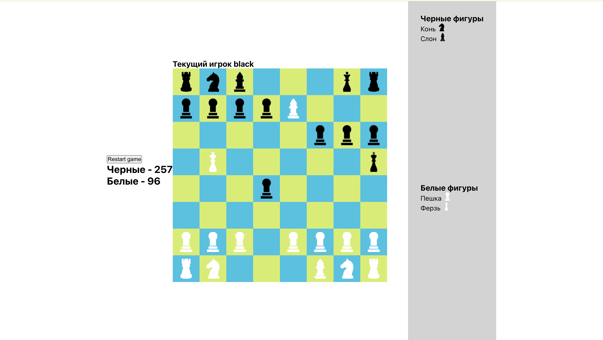

# 
Разработка шахмат на REACT+TYPESCRIPT (Практика ООП)

## 
Попробуй<a href="https://my-chess-farids-projects-eaf9b1b4.vercel.app/">👨‍💻</a>

### Стек технологий:

- REACT;
- TYPESCRIPT;
- REACT HOOKS;
- JEST;
- REACT-TESTING-LIBRARY...

### 🏆 Основные функции шахматного приложения:

#### Игровая доска

- Отображение шахматной доски (8×8) с фигурами
- Подсветка возможных ходов
- Анимация перемещения фигур

#### Логика игры

- Правила перемещения фигур (пешки, ладьи, кони и т.д.)
- Проверка на шах и мат

#### Режимы игры

- Локальная игра (2 игрока на одном устройстве)

#### Дополнительные возможности

- Таймер (классика)
- Меню рестарта
- Меню съеденных фигур

### Скрин

  

